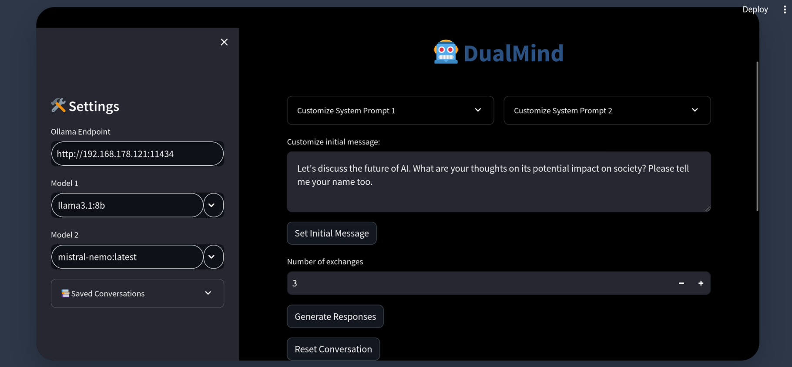

# DualMind: AI Conversation Simulator

***WARNING: This repository approach has been superseeded by the [Self Conversational AI](https://github.com/tcsenpai/llms-experiments?tab=readme-ov-file#self-conversational-ai) Experiment in [LLM Experiments](https://github.com/tcsenpai/llms-experiments)***

DualMind is an innovative AI conversation simulator that facilitates engaging dialogues between two AI models using the Ollama API. It offers a command-line interface (CLI) for immersive and customizable AI interactions.



## Features

- 🤖 Dual-model conversation: Engage two different AI models in a thought-provoking dialogue
- 🎭 Customizable system prompts: Tailor the behavior and personality of each AI model
- 🖥️ Command-line interface for quick interactions
- 🛠️ Conversation customization:
  - Adjust the number of exchanges
  - Modify the initial prompt
  - Select different AI models
- 💾 Save conversation logs
- 🔢 Token count display and limit: Monitor the token usage for each message and limit the conversation to a specified number of tokens.

## Prerequisite: Ollama

This project is privacy oriented and for such reason it uses Ollama as a backend. You need an Ollama endpoint to use this software.

Please refer to [Ollama](https://ollama.com/download) to install Ollama on your machine.

## Installation

1. Clone the repository:

   ```sh
   git clone https://github.com/yourusername/DualMind.git
   cd DualMind
   ```

2. Install the required dependencies:

   ```sh
   pip install -r requirements.txt
   ```

3. Set up your environment variables by creating a `.env` file in the project root:

   ```
   OLLAMA_ENDPOINT=http://localhost:11434
   MODEL_1=llama2
   MODEL_2=mistral
   INITIAL_PROMPT="Let's discuss the future of AI. What are your thoughts on its potential impact on society?"
   MAX_TOKENS=8000
   ```

   Feel free to use the env.example file as a template.

   **Note:** The INITIAL_PROMPT is the first message that will be sent and it will be send on behalf of the second AI to the first AI.

## Usage

To run DualMind in CLI mode:

```sh
./start_cli.sh
```

## Customization

### System Prompts

You can customize the system prompts for each AI model by editing the `system_prompt_1.txt` and `system_prompt_2.txt` files in the project root.

### Options

You can customize the options for the conversation by editing the `options.json` file in the project root.


## Project Structure

- `main.py`: Entry point of the application
- `ai_conversation.py`: Core logic for AI conversations
- `start_cli.sh`: Shell script to run the CLI version


## Contributing

Contributions are welcome! Please feel free to submit a Pull Request.

## License

This project is open source and available under the [MIT License](LICENSE).

## Acknowledgements

- This project uses the [Ollama](https://ollama.ai/) API for AI model interactions.
